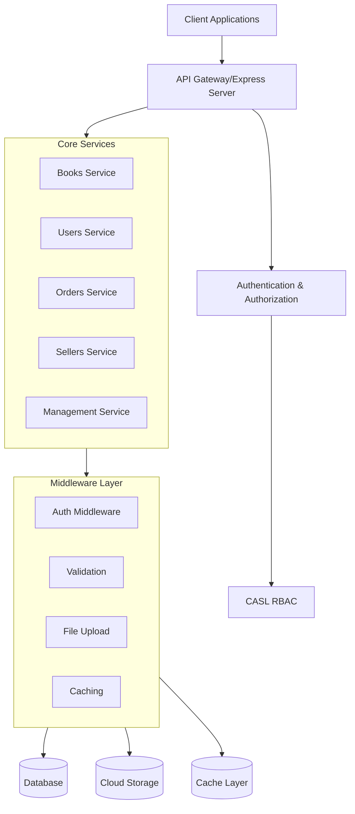
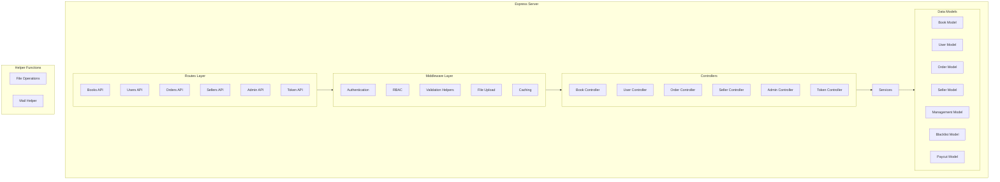

# Bookilo - Architecture Diagrams

## High-Level Design (HLD)

## Low-Level Design (LLD)

## Component Details

### Core Components:
1. **Authentication & Authorization**
   - JWT-based authentication
   - CASL-based RBAC for fine-grained permissions
   - Token blacklisting support

2. **User Management**
   - User registration and authentication
   - Profile management
   - Password reset functionality

3. **Book Management**
   - Book CRUD operations
   - Search and filtering
   - Image upload support

4. **Order System**
   - Order creation and management
   - Order status tracking
   - Payment integration

5. **Seller Management**
   - Seller registration and verification
   - Product management
   - Order fulfillment

6. **Admin Dashboard**
   - User management
   - System monitoring
   - Configuration management

### Technical Stack:
- **Backend**: Node.js + Express.js
- **Database**: MongoDB (implied from models)
- **File Storage**: Cloud storage integration
- **Caching**: Node-cache implementation
- **API Documentation**: Swagger
- **Security**: JWT, CASL RBAC

### Key Features:
1. Role-Based Access Control (RBAC)
2. File upload support (local & cloud)
3. Input validation
4. Email notifications
5. Caching layer
6. API documentation
7. Error handling
8. Logging system
